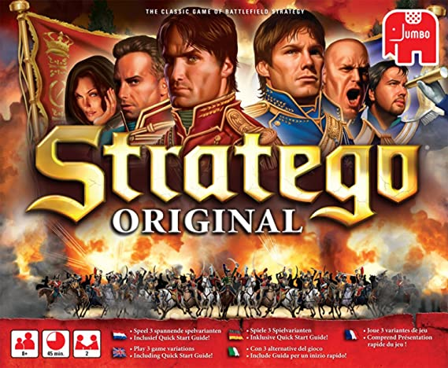
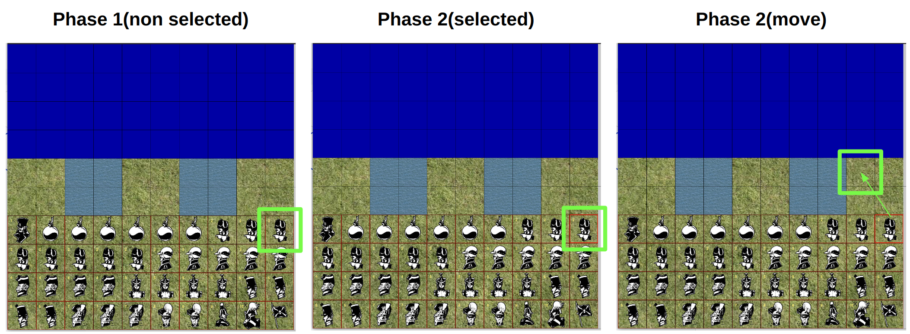
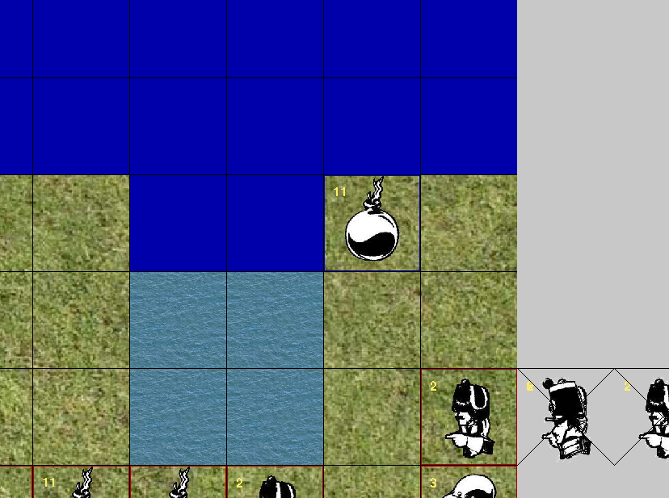

# Introduction
An OpenAI Gym for the Python implementaion of the [Stratego board game](https://github.com/JeroenKools/gpfj) to benchmark Reinforcement Learning algorithms. Thank you for the [JeroenKools](https://github.com/JeroenKools).



The DeepMind uses the Stratego game as enviroment at the paper titled [Mastering Stratego, the classic game of imperfect information](https://www.deepmind.com/blog/mastering-stratego-the-classic-game-of-imperfect-information). At this paper, they used the algorithm called DeepNash to find the Nash equilibrium when training the agent using Deep Reinformance Learning. 

# Install
```
$ git clone https://github.com/kimbring2/gym-stratego
$ cd gym-stratego
$ pip install -e .
```
# OpenAI Gym Sequence
Unlike the other game like a Pong, the Stratego has a multipl unit. Therefore, the step process consist of three phase. At the first phase, you should select one of your unit. At the second phase, the selected unit has the bold boundary line. At the third phase you need to decide the possition where the selectec unit of first phase will move to. 



At the start of game, player have no information about rank of opponent unut. However, the rank unit that is engaged in battle and survive is revealed to player.



Additionally, you can see the the dead unit of player and opponent at the right side panel. 

# Observation and Action
| State |  Format |
| ------------- | ------------- |
| battle_field | Numpy array that has (10, 10, 3) shape. The value of array is the int(unit.rank * 10) for player unit and known opponent unit. The 30.0 for unknown opponent unit.|
| red_offboard | Tag number for the dead unit of player. E.g. [10, 7, 6, 6, 6, 5, 4, 3, 2, 2, 2, 2, 2, 2, 2, 1] |
| blue_offboard | Tag number for the dead unit of opponent. E.g. [7, 7, 6, 5, 5, 4, 4, 3, 3, 3, 3, 2, 2, 2, 2, 2, 2, 2, 11, 11, 1] |
| movable_units | Tag number for the unit of player which can control for next turn. E.g. [0, 2, 3, 6, 10, 13, 14, 15, 16, 17, 18, 20, 21, 22, 23, 26] |
| movable_positions | The x, y coordinate of battle field where the selected unit of player can move for next turn. E.g. [(6, 3), (7, 2), (8, 3)] |

# Example Code
Please run the env_test.py file for that.

# Play as human
It is possible to play the game manually. Please change the ```env.step(action)``` part as of code as ```env.step_render()```.

Below is demo video for that.

[](https://youtu.be/QlrTqNp1R3U "Play as human video - Click to Watch!")
<strong>Click to Watch!</strong>
