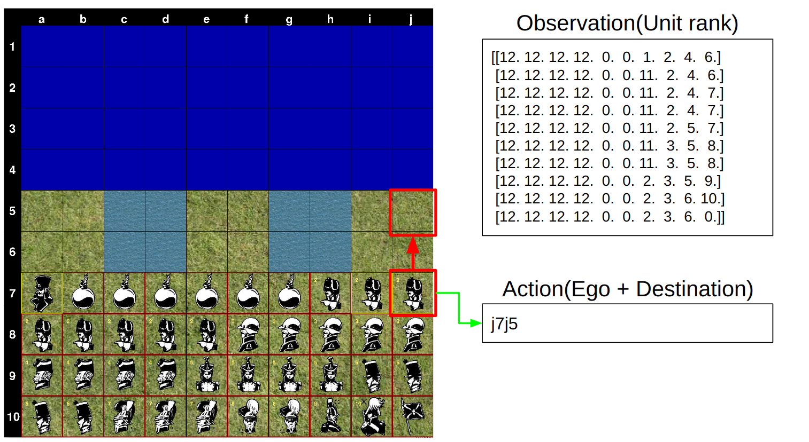
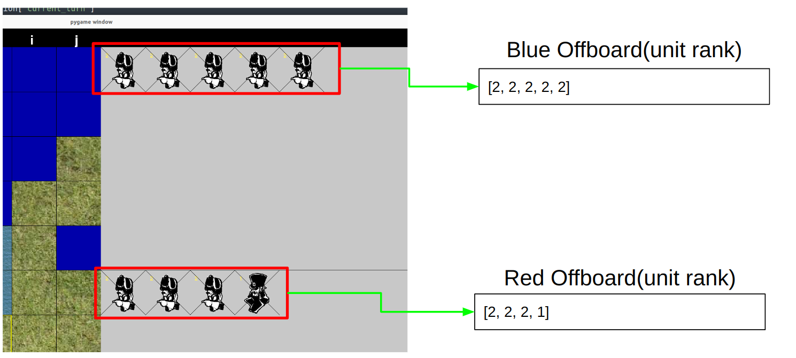
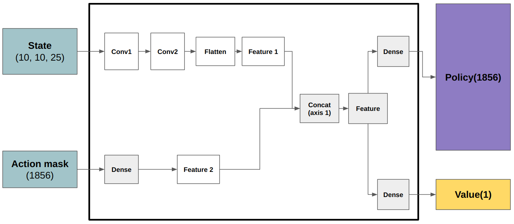

# Introduction
An OpenAI Gym for the Python implementaion of the [Stratego board game](https://github.com/JeroenKools/gpfj) to benchmark Reinforcement Learning algorithms. Thank you for the [JeroenKools](https://github.com/JeroenKools).


The DeepMind uses the Stratego game as enviroment at the paper titled [Mastering Stratego, the classic game of imperfect information](https://www.deepmind.com/blog/mastering-stratego-the-classic-game-of-imperfect-information). At this paper, they used the algorithm called DeepNash to find the Nash equilibrium when training the agent using the Deep Reinforment Learning.

# Reference
- Custom OpenAI Gym code: https://github.com/vadim0x60/heartpole
- Python2 implementation of Stratego game: https://github.com/JeroenKools/gpfj

# Install
```
$ git clone https://github.com/kimbring2/gym-stratego
$ cd gym-stratego
$ pip install -e .
```

Additionally, you need to install the ```Tkinter``` for your Python. Below is an example of the Python 3.9 version.
```
$ sudo apt-get install python3.9-tk
```

# Observation and Action


# Reward
The 1 and -1 will be given to the winner and loser at the end of the game respectively.

# Observation of off-board unit 


# Environment test code
After installing, please run the [environment test code](https://github.com/kimbring2/gym-stratego/blob/main/examples/stratego_env_test.py). There are two options you can choose, enemy_ai and human_play.

For example, you can play with the built-in AI using the command below.

```
python stratego_env_test.py --enemy_ai True --human_play True
```

# Agent train code
First, I trained the agent against the [built-in AI​](https://github.com/kimbring2/gym-stratego/tree/main/gym_stratego/envs/brains) of the original code. Note that, 
## Network architecture


## Training result
Because I am experimenting with AI that is as easy as possible and increasing the level of difficulty one by one, it cannot be said that it shows the same performance as DeepMind's original paper.

For example, in the case of AI where the location of each unit is fixed, it was confirmed that learning was successful even without using DeepNash.

